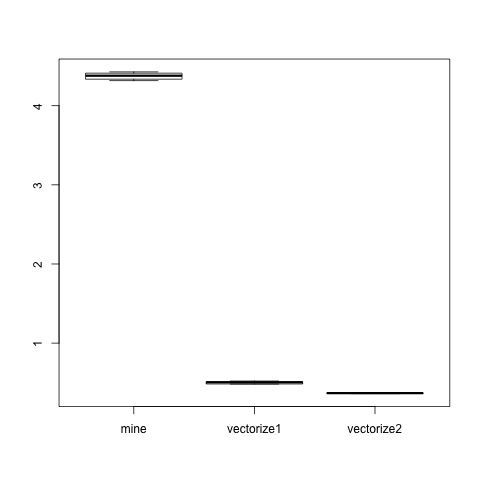

# Day 4

+ [Outline of Topcs in slides](Topics.html)
+ [Same material as a markdown document (not slides)](Topics.md)

+ [mineSubFunctions.R](mineSubFunctions.R) - line2DF() from [mine.R](../Day3/mine.R) but broken into
   several smaller functions - 
+ [vectorize.R](vectorize.R)  - first version to "vectorize" the computations across lines
+ [vectorize1.R](vectorize1.R)  - vectorize.R but puts names on columns of the results
+ [vectorize2.R](vectorize2.R)  - an slightly faster approach.

## Timings of the 3 Approaches

+ by line
+ across lines
+ faster still

