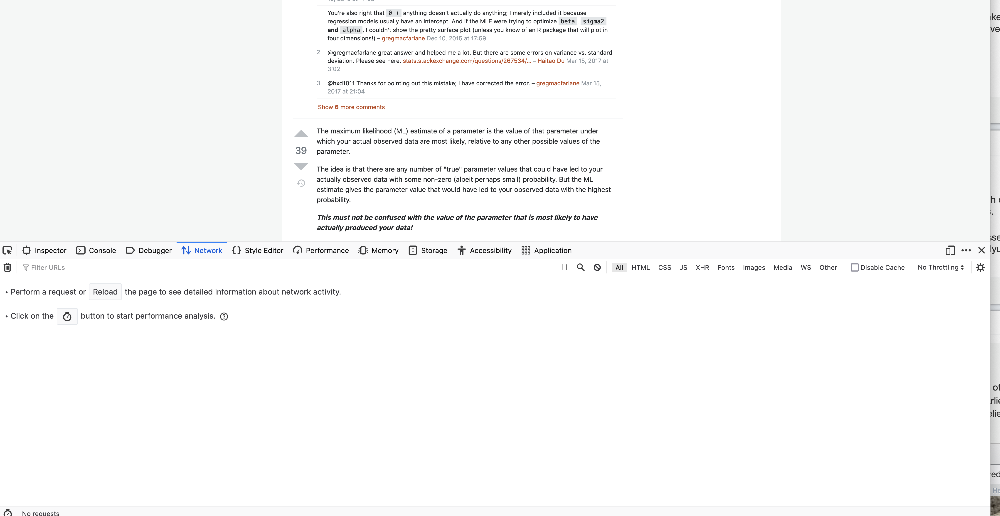
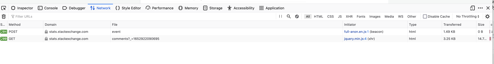

We start by loading R packages to 

+ perform HTTP/HTTPS requests
+ parse HTML or XML content


```r
library(RCurl)
library(XML)
```

There are other similar packages - curl, xml2, httr


We'll get the information from the following post
```r
u = "https://stats.stackexchange.com/questions/112451/maximum-likelihood-estimation-mle-in-layman-terms"
```

We fetch it from the Web server with `getURLContent()`
```r
txt = getURLContent(u, followlocation = TRUE)
```

We could work with the text, but we want the HTML tree as a structured
object of nodes and their children and attributes.
```r
doc = htmlParse(txt)
```

We can explore the HTML document for the patterns to find
+ question
+ answers
+ comments

We can also do this programmatically.
Probably best to do it manually at first using a text editor


```r
cat(txt, file = "so.html")
```
So now we  explore this in our text editor.

Look for the text of the question or title.
Then go back up the "tree" looking for attributes that identify
this as the title or question.

On line 689, we have
```
<div class="question" data-questionid="112451" data-position-on-page="0" data-score="117"  id="question">
```
The class is question. The id is question.

class and id are attributes on an HTML node named div.

+ Nodes are started by `\<nodeName`  and there can be name=value attributes and then an ending \>
+ Then the contents of the node can be other nodes and/or text.
+ Then the end/close of the is `</nodeName>`

The contents of the node are child nodes.
They can have their own children, and attributes.

A node that has not sub-content can be opened and closed with 
```
<nodeName />
```
It can also have attributes before the `/>`.


Let's look for the answers.
Again, we can look for the text of the first answer.
Alternatively, we can look for `class="answer"` to see if it is present and parallels the class
attribute
for the question.

We find
```
<div class="answers-subheader d-flex ai-center mb8">
```

and nex
```
<div id="answer-112458" class="answer js-answer accepted-answer" data-answerid="112458" data-parentid="112451" data-score="90" data-position-on-page="1" data-highest-scored="1" data-question-has-accepted-highest-score="1"  itemprop="acceptedAnswer" itemscope itemtype="https://schema.org/Answer">
```	 
    
The first is a container for all the answers for this page.

The second looks like a specific answer.

+ The id attribute starts with answer and then the answer Id.
+ the class attribute starts with answer
+ there is a data-answerid attribute.
+ we have a data-parentid attribute.
+ we see itemprop="acceptedAnswer".


Let's programmatically find all the <div> nodes that have a data-answerid attribute.
We will use XPath. (Consider the alternatives and how horrible they would be!)

```r
ans = getNodeSet(doc, "//div[@data-answerid]")
length(ans)
```
We found 14 of these nodes and there are 14 answers. Looking good.

We'll come back to how to process each of these nodes to get the answer text/body,
the user, when it was posted, ...


Next, let's look for comments.
The first comment starts with  "It's unclear what kind of answer".
So let's go back to the top of the file in our editor and look for this.

If we look for It's, we don't find any matches.
Probably some smart apostrophe. 
So let's look for "unclear what kind"

We find
```
 <span class="comment-copy">It&#39;s unclear what kind of answer you&#39;re after. Do you know what likelihood is, for example? If not, better to find out that first.</span>
```
That's the comment.
This is inside

```
    <div class="post-layout--right js-post-comments-component">
        <div id="comments-112451" class="comments js-comments-container bt bc-black-075 mt12 " data-post-id="112451" data-min-length="15">
            <ul class="comments-list js-comments-list"
                    data-remaining-comments-count="0"
                    data-canpost="false"
                    data-cansee="true"
                    data-comments-unavailable="false"
                    data-addlink-disabled="true">

                        <li id="comment-215516" class="comment js-comment " data-comment-id="215516" data-comment-owner-id="805" data-comment-score="9">
        <div class="js-comment-actions comment-actions">
            <div class="comment-score js-comment-edit-hide">
                    <span title="number of &#x27;useful comment&#x27; votes received"
                            class="warm">9</span>
            </div>
        </div>
        <div class="comment-text  js-comment-text-and-form">
            <div class="comment-body js-comment-edit-hide">
                <span class="d-none">$egingroup$</span>
                <span class="comment-copy">It&#39;s unclear what kind of answer you&#39;re after. Do you know what likelihood is, for example? If not, better to find out that first.</span>
                <span class="d-none">$endgroup$</span>
              <div class="d-inline-flex ai-center">
&ndash;&nbsp;<a href="/users/805/glen-b"
                            title="259,366 reputation"
                            class="comment-user">Glen_b</a>
                </div>
                <span class="comment-date" dir="ltr"><span title="2014-08-19 12:56:32Z, License: CC BY-SA 3.0" class="relativetime-clean">Aug 19, 2014 at 12:56</span></span>
                        <span title="this comment was edited 1 time">
                            <svg aria-hidden="true" class="va-text-bottom o50 svg-icon iconPencilSm" width="14" height="14" viewBox="0 0 14 14"><path d="m11.1 1.71 1.13 1.12c.2.2.2.51 0 .71L11.1 4.7 9.21 2.86l1.17-1.15c.2-.2.51-.2.71 0ZM2 10.12l6.37-6.43 1.88 1.88L3.88 12H2v-1.88Z"/></svg>
                        </span>
            </div>
        </div>
    </li>
```

We see more <div> nodes with @class starting  with "comments",
"comment-text", "comment-body".

If you know what you are looking for, you see <li> and </li> and also the <ul> before the <li>.
<ul> starts an unnumbered list  and the <li> are "list items".


The <li> has a class attribute that starts with the string `comment`
and it also has a data-comment-id attribute.

Within the <li> we have the comment's

+ text, 
+ user name
+ date in the title attribute
+ text of the date and time
+ owner-id


Let's programmatically find all the comments

```
a = getNodeSet(doc, "//li[starts-with(@class, 'comment')]")
b = getNodeSet(doc, "//li[@data-comment-id]")
```
Both return 34 nodes and `identical(a, b)` is `TRUE`,
so either approach gives the same answer - in this case!


We do want to be able to associate each comment with the question or specific answer.
So we want to be able to find this question/anser from the comment, or find the comments from this
question/answer.


## Processing the Page - Extracting the Question, Answer, Comments

Before we process the page, we need to decide what
structure we want at the end.

We might have a data.frame like the Posts table
that contains the Question, the Answers.

+ What information do we want from the Question?
+  from each Answer
+ Where do we put the Comments?


## Processing an Answer


We want to extract 

+ the text
+ the parent Id
+ whether it was the accepted answer
+ the user name
+ the user id
+ the date posted
+ date accepted if it is the accepted answer
+ whether it was edited, and if so
   + how many times
   + by whom
   + when


It appears the text is in a <div> with class "s-prose js-post-body".

   +  Are there other <div> children of this answer node that have this same class?
```r
length(getNodeSet(ans[[1]], ".//div[@class='s-prose js-post-body']"))
```
   So there appears to be only one.  So we possibly can find the text with this.


The text for the answers is a child of a <div> node with a @class that starts with `answercell`.
We can be more specific by saying that the s-prose div node has to be a child of a div node that has
a class with answercell in the @class value.


## Processing a Comment

The comment Id is an attribute - data-comment-id - in the `<li>` introducing the comment.
Similarly, the user id is in the data-comment-owner-id


Text is in 
```
<div class="comment-text ...">
  <div class="comment-body ...">
    <span class="comment-copy">
```

The date is in a <span> node with class = comment-date
and within the title of a child <span> node.


## Getting the Additional Comments


For this answer, we see near the end "Show <b>6</b> more comments".
Are a) these comments in the HTML but hidden, or b) does the Web browser have to go back to the server to
fetch these 6 other comments?
If b), how do we get them.

If we click on the "Show 6 more comments", look at the new comment and then try to find the
corresponding text ("need to clearly specify"), it doesn't seem to be present.
So it looks like b).


We'll use the Web browser's Developer Tools to see what happens when we click on the next
set of "Show more comments" link.

In Firefox, open the developer tools subwindow/panel via the key combinatin Option-Command I  or via
the menu `Tools -> Browser Tools -> Developer Tools`.

Click on the Network tab in the developer tools.
We see something like



We have scrolled to the next "Show 6 more comments".
Now we click on that.


We then get 



There are two lines.
We click on one and we get a new panel on the right.
This has tabs Headers, Cookies, Request, Response, Timings, ...
We will click on the Response and look at the results for each of these two lines
in that tab.
The first has none.
The second shows the HTML of these additional comments.


We click on the Headers tab to see the details of the HTTP request to get this sub-document.


How do we know if there are additional comments we need to fetch?
The `\<ul\>` for the comments has an attribute
named `data-remaining-comments-count`:

```
  <ul class="comments-list js-comments-list"
      data-remaining-comments-count="6"
      data-canpost="false"
```
