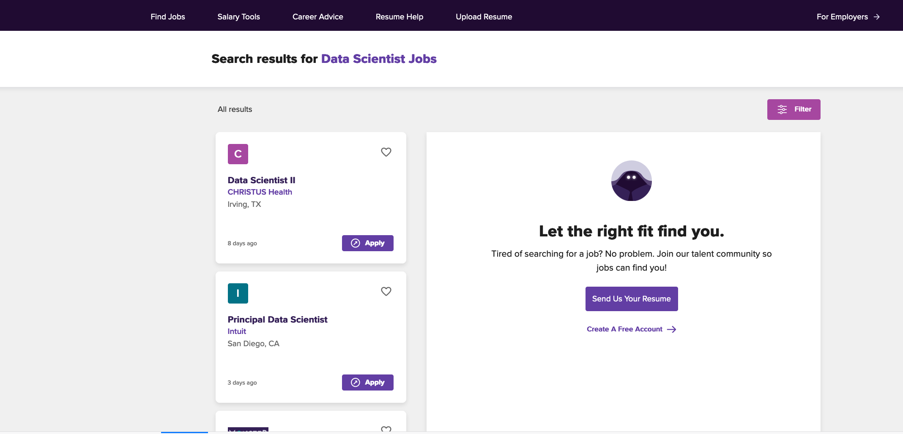
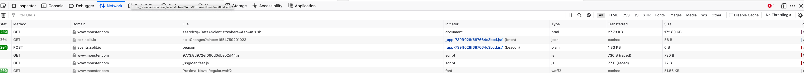
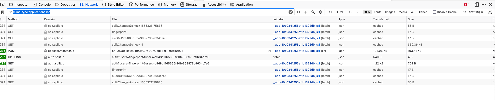
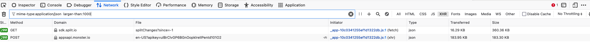
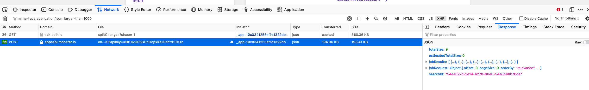
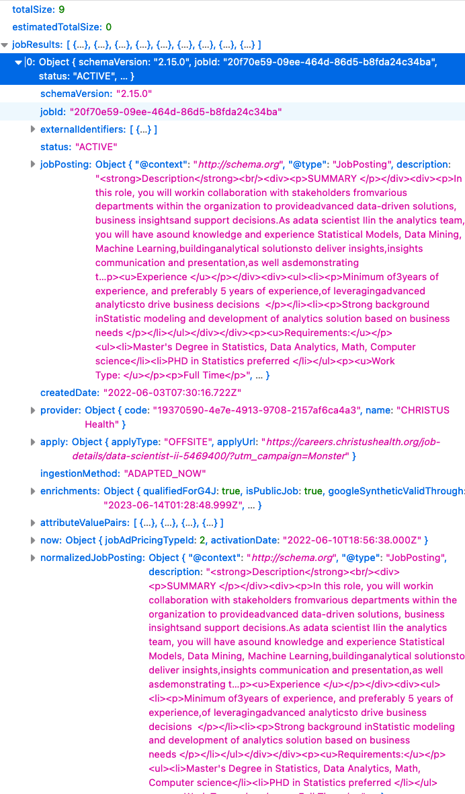
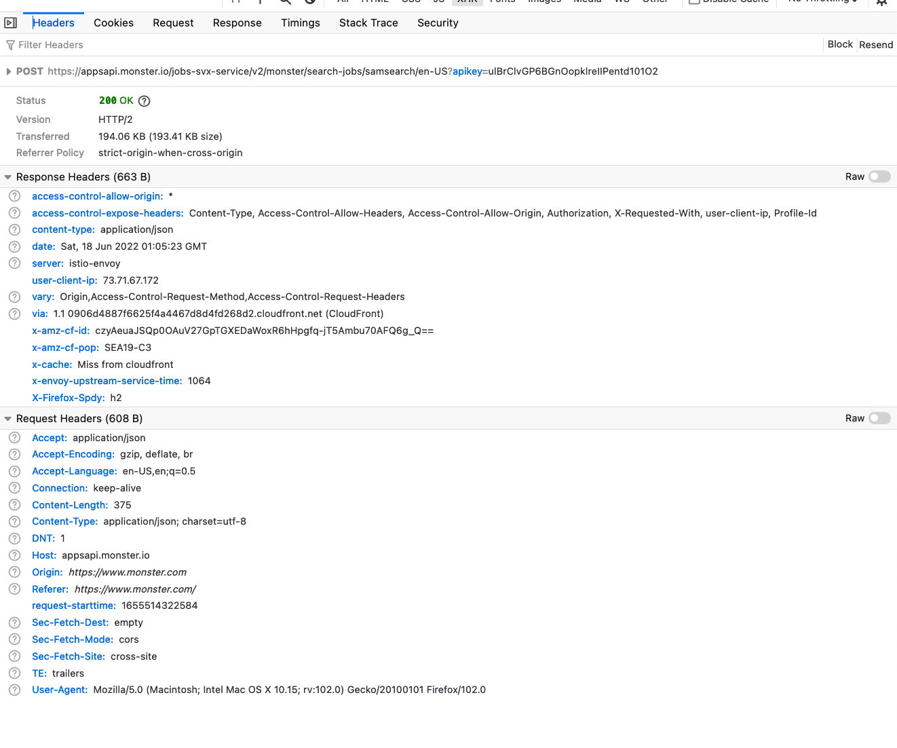
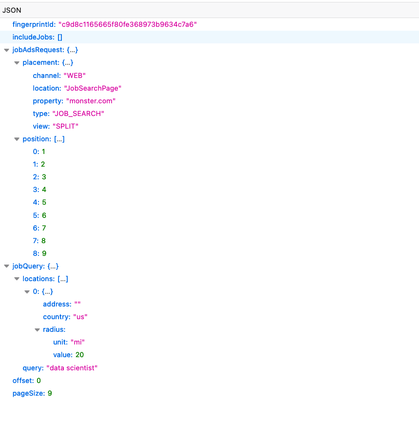
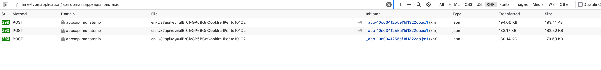
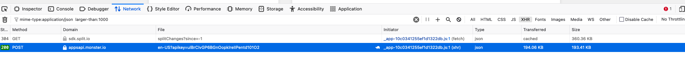

# Scraping Monster.com

## Duncan Temple lang
## *DO NOT SHARE*
## June, 2022
## STA141B


See [Git Repository for course](https://github.com/duncantl/STA141B_S22/tree/main/monster.com)
for files.


*Note, the specific details will change each time we make a query to monster.com.
For this reason, some of the images and text may not match.
Importantly, we have to write our code to not hard-code the elements that will change.
Instead, we have to abstract those aspects and ensure we compute the relevant  information.
*


We start in the Web browser and perform a search for a job description in the monster.com Web page
as shown here:




The first result is for a company named `CHRISTUS Health`.  ( It will be different when you do this.)

We view the page source in the browser and look for one of the words, e.g., CHRISTUS. (Again, it
will be different when you do this.)
It is not in the HTML.  This suggests the content is not static, but dynamic.


We'll look at all the HTTP(S) requests  for this page and search through them to see which, if any,
have information/data for these results.

We open the developer tools and its
[Network tab](https://firefox-source-docs.mozilla.org/devtools-user/network_monitor/request_list/index.html),
and repeat the query,
e.g., reload the page.

There are a lot of requests




We have to go through each one looking for a response that may contain the job descriptions.
This is a slow, tedious, manual task. 

The Type  column shows HTML, JavaScript (js), plain (text), json, wolf2.

We might look for all the requests that return data as JSON. 
One way to do this is to filter just those requests that return JSON, i.e., have a type json.

See 
[Filtering requests in the Developer Tools](https://firefox-source-docs.mozilla.org/devtools-user/network_monitor/request_list/index.html)


In the filter text box, we enter `mime-type:application/json`
We get the following in the browser



We have 10 requests returning JSON.  This helps filter the requests.

For some Web sites, there will be still be a lot of these requests.
We might want to ignore those that have only a few bytes (the B at the end of the Size column).
So we add to the filter criteria
```
mime-type:application/json  larger-than:1000
```

This gives us 

leaving only 2 requests.

We can click on each of these and then look at the Response tab in the details for the request.



This is JSON and has several top-level elements in the result - totalSize, estimatedTotalSize,
jobResults, jobRequest.

Let's expand the jobResults and its first element:



Scanning the content, we see `CHRISTUS` in the provider field.  This does appear to be the first job
result  we see in the actual Web page.

The second element in the JSON is from Intuit, corresponding to the second result we see on the Web
page.

We have found the request that gives us the results.

We could copy the JSON (via the Raw and copy) and then process this in R 
to verify the results are what we expect.
However, we are pretty certain this is the request we want.

So let's examine this request. 
We look at the **Headers** tab to identify the details of the request.




+ This is a POST request,
+ the URL is
  `https://appsapi.monster.io/jobs-svx-service/v2/monster/search-jobs/samsearch/en-US?apikey=ulBrClvGP6BGnOopklreIIPentd101O2`
+ the headers include
   + `Accept: application/json`
   + `Content-Type: application/json; charset=utf-8`
   + and many others.
   

There is no cookie in the request header.


Since this is a POST request, we need to examine the body of the request, i.e., in the `Request` tab.



The raw JSON string is 
```json
{"jobQuery":{"query":"data scientist",
             "locations":[{"country":"us","address":"","radius":{"unit":"mi","value":20}}]},
 "jobAdsRequest":{"position":[1,2,3,4,5,6,7,8,9],
                  "placement":{"channel":"WEB","location":"JobSearchPage","property":"monster.com",
				               "type":"JOB_SEARCH","view":"SPLIT"}},
  "fingerprintId":"c9d8c1165665f80fe368973b9634c7a6",
  "offset":0,
  "pageSize":9,
  "includeJobs":[]
}
```

We can see our query string "data scientist".  If we want to perform a different search,
we can probably replace that value with a different query and submit the request.
We have to verify this by doing a different search in the Web browser and inspecting the body 
of the resulting POST request in the Web browser's developer tools.

In the JSON for the body of the request, the search is limited to 20 miles in the radius field of the locations element.
We should change this to something very large to include the US. 

Alternatively,
we could change the query in the Web browser and see how the body of the Request changes.

The pageSize with a value of 9 is something we may want to change.
If we do, we may want to change the related array of `[1, 2, 3, ... 9]`
or see if that matters.


Let's replicate this HTTPS request from R to verify we are on the right track.
This can potentially  be somewhat trial and error as we find we need to add more headers in the
request, but we have the basic elements and building blocks:

+ URL
+ POST request
+ body of the request
+ Content-Type header

```{r}
u = "https://appsapi.monster.io/jobs-svx-service/v2/monster/search-jobs/samsearch/en-US?apikey=ulBrClvGP6BGnOopklreIIPentd101O2"
body = '{"jobQuery":{"query":"data scientist",
             "locations":[{"country":"us","address":"","radius":{"unit":"mi","value":20}}]},
         "jobAdsRequest":{"position":[1,2,3,4,5,6,7,8,9],
                          "placement":{"channel":"WEB","location":"JobSearchPage","property":"monster.com",
				               "type":"JOB_SEARCH","view":"SPLIT"}},
  "fingerprintId":"c9d8c1165665f80fe368973b9634c7a6",
  "offset":0,
  "pageSize":9,
  "includeJobs":[]
}'
```

We can make the request

```{r}
library(RCurl)
response = postForm(u, .opts = list(postfields = body, 
                                    httpheader = c("Content-Type" = "application/json;charset=utf-8"), 
									verbose = TRUE))
```
```
*   Trying 52.84.162.109:443...
* Connected to appsapi.monster.io (52.84.162.109) port 443 (#0)
* ALPN: offers h2
* ALPN: offers http/1.1
*  CAfile: /etc/ssl/cert.pem
*  CApath: none
* SSL connection using TLSv1.3 / TLS_AES_128_GCM_SHA256
* ALPN: server accepted h2
* Server certificate:
*  subject: CN=*.monster.io
*  start date: Sep  6 00:00:00 2021 GMT
*  expire date: Oct  5 23:59:59 2022 GMT
*  subjectAltName: host "appsapi.monster.io" matched cert's "*.monster.io"
*  issuer: C=US; O=Amazon; OU=Server CA 1B; CN=Amazon
*  SSL certificate verify ok.
* Using HTTP2, server supports multiplexing
* Copying HTTP/2 data in stream buffer to connection buffer after upgrade: len=0
* h2h3 [:method: POST]
* h2h3 [:path: /jobs-svx-service/v2/monster/search-jobs/samsearch/en-US?apikey=ulBrClvGP6BGnOopklreIIPentd101O2]
* h2h3 [:scheme: https]
* h2h3 [:authority: appsapi.monster.io]
* h2h3 [accept: */*]
* h2h3 [content-type: application/json;charset=utf-8]
* h2h3 [content-length: 439]
* Using Stream ID: 1 (easy handle 0x14486dc00)
> POST /jobs-svx-service/v2/monster/search-jobs/samsearch/en-US?apikey=ulBrClvGP6BGnOopklreIIPentd101O2 HTTP/2
Host: appsapi.monster.io
accept: */*
content-type: application/json;charset=utf-8
content-length: 439

* We are completely uploaded and fine
* Connection state changed (MAX_CONCURRENT_STREAMS == 128)!
< HTTP/2 200 
< content-type: application/json
< date: Sat, 18 Jun 2022 02:22:00 GMT
< vary: Origin,Access-Control-Request-Method,Access-Control-Request-Headers
< user-client-ip: 73.71.67.172
< x-envoy-upstream-service-time: 1014
< server: istio-envoy
< x-cache: Miss from cloudfront
< via: 1.1 d15b6a95f7c8298444f59a99d8027cec.cloudfront.net (CloudFront)
< x-amz-cf-pop: SEA19-C3
< x-amz-cf-id: aKnvF3IH14bvGdAZLeaXn5hhestwVz-t3Ev3t1cspXtZqhlh7xu8QQ==
< 
* Connection #0 to host appsapi.monster.io left intact
```

This all looks good.  We get a 200 response indicating success.
We can see the path in the URL in the POST request.
We also see the header fields from the request.
Then we see the headers from the response.

The number of characters in the response is  197581
```{r}
nchar(response)
```
This is a good sign that we got something substantial back.

We can determine the type/format of the response with
```{r}
attributes(response)
$`Content-Type`
[1] "application/json"
```
So we verify this is JSON, as we knew from the Web browser (and our response headers above from R).

Now we can convert this to an R object:
```{r}
library(RJSONIO)
jobs = fromJSON(response)
```

We explore this:
```{r}
names(jobs)
[1] "totalSize"          "estimatedTotalSize" "jobResults"        
[4] "jobRequest"         "searchId"          
```


```{r}
length(jobs$jobResults)
[1] 9
```


```{r}
jobs$jobResults[[1]]$jobPosting$hiringOrganization

$`@context`
[1] "http://schema.org"

$`@type`
[1] "Organization"

$description
[1] "<p>In 1999, two historic Catholic charities became one, forming CHRISTUS Health and creating a unique purpose in the modern health care market - to take better care of people. </p> <p>To extend the healing ministry of Jesus Christ, the mission that the Sisters of Charity Health Care system and Incarnate Word Health system shared for more than a century, is now also the mission of CHRISTUS Health. </p> <p>Ranked among the top 10 Catholic health systems in the United States by size, the CHRISTUS Health system includes more than 40 hospitals and facilities in seven U.S. states, Chile and six states in Mexico, with assets of more than $4.6 billion. </p> <p>Whether seeking care in Alexandria Louisiana, or Coahuila, Mexico, patients discover that the healing spirit is alive at CHRISTUS Health. </p>"

$sameAs
[1] "http://www.christushealth.org/"

$name
[1] "CHRISTUS Health"

$foundingDate
[1] "1999"

$numberOfEmployees
                  @context                      @type 
       "http://schema.org"        "QuantitativeValue" 
                  unitText 
"10,000 employees or more" 

$logo
[1] "//media.newjobs.com/mm/x695205hjsx/cp/christushealth.png"
```

So we have the results from the first page of this query.


At this point, we have two separate/orthogonal directions to explore

+ how to find the next page of results
+ how to change the request for a different search string (other than data scientist) and change the
  radius of the search.


Additionally, we can explore how to change the page size, i.e., the number of results per page.
This is not essential. However, if we can get, for example, 100 results per request, we will have to
do fewer requests to get the total number of jobs for a given query.

We can do these in either order.

## Next Page

We start by looking at how to get the next set of results.
There is no "Next" or "Next Page" button. Instead, one just scrolls through the list
of jobs and when you get to the end of the list, the Web page displays the next set of results.
The page may already have the next set of results, or alternatively it may 
make an HTTPS request to get them and then display them.  So we want to see if
there is a second request and then subsequent requests.

We have already set our filter for `mime-type:application/json larger-than:1000`.
We can also add `domain:appsapi.monster.io` as that is the domain of the URL for the request that
gets the results. This is assuming the requests for the next set of results will go to that domain.
We don't have to make that assumption, and can instead examine all requests with JSON responses,
or indeed all requests.

After this, we scroll through the list of job results. As we move past 9, the browser requests
the next page.



This shows 3 pages of requests - the first, second and third.
They have approximately the same size 180K to 194K bytes.

If you are paying close attention to the Web browser, you will notice that as we get the next set of
results,
the URL in the location/URL text field changes to
```
https://www.monster.com/jobs/search?q=data+scientist&where=&page=2&so=m.h.sh
```
However, this is not the URL from which we are getting the next set of results.


We check the JSON for the response for each page and check it agrees with what we see in the Web page.
Confirming this, we move on.

We'll look at the JSON for body of the second request:



This looks very similar to the body for the first page we received.
We might think it is the same.

It is a good idea to programmatically verify it is the same, or find the differences.

We switch to the "Raw" view of the JSON in the Request tab and copy the content of the bod and parse it in R.


```{r}
b1 = fromJSON(body)

b2 = fromJSON('{"jobQuery":{"query":"data scientist","locations":[{"country":"us","address":"","radius":{"unit":"mi","value":20}}]},"jobAdsRequest":{"position":[1,2,3,4,5,6,7,8,9],"placement":{"channel":"WEB","location":"JobSearchPage","property":"monster.com","type":"JOB_SEARCH","view":"SPLIT"}},"fingerprintId":"c9d8c1165665f80fe368973b9634c7a6","offset":9,"pageSize":9,"searchId":"54ea027d-2e14-4270-80e0-54a8d40b78de"}')
```

```{r}
all.equal(b1, b2)
[1] "Names: 1 string mismatch"                                         
[2] "Component “offset”: Mean absolute difference: 9"                  
[3] "Component 6: Modes: list, character"                              
[4] "Component 6: Attributes: < Modes: list, NULL >"                   
[5] "Component 6: Attributes: < names for target but not for current >"
[6] "Component 6: Attributes: < current is not list-like >"            
[7] "Component 6: Length mismatch: comparison on first 0 components"   
```
There is only one element that is different.
The first request has the final element named `includeJobs`, while the 
second has `searchId`.
```{r}
all.equal(names(b1), names(b2))
cbind(names(b1), names(b2))

     [,1]            [,2]           
[1,] "jobQuery"      "jobQuery"     
[2,] "jobAdsRequest" "jobAdsRequest"
[3,] "fingerprintId" "fingerprintId"
[4,] "offset"        "offset"       
[5,] "pageSize"      "pageSize"     
[6,] "includeJobs"   "searchId"     
```


The second difference is in line 2 of the output from all.equal() above.
The value  of the `offset` element is not 0 but 9 for this request.
This indicates the index/offset from where  to start the next set of results.
When we look at the request for the third page of results, we see offset is 18.
There were 18 results obtained before this set.


To faithfully make this request, we need to get the body for the 2nd and hopefully 
3rd, 4th, ... pages to look like this.

Where do we get the searchId value from?

While there is no obvious, a priori way to know this, it is in the Response from the first page of
results. This was the variable `jobs`  above:
```{r}
names(jobs)
[1] "totalSize"          "estimatedTotalSize" "jobResults"        
[4] "jobRequest"         "searchId"          
```
Note the `searchId` name at the end. 
The value is 
```{r}
jobs$searchId
[1] "807976f6-ddd9-46b7-a3d1-68b396dbcbf7"
```

We had to find this out by examining the body 
+ of the first request,
+ of the response of the first request, 
+ the body of the second request


We are now in position to get the second and subsequent set of search results.

The basic steps are 
+ use the JSON from the body of the first request as the template for the body of the request. Call
  this `body`.
+ make the POST request
+ convert the resulting JSON to an R list
   + extract the jobResults
   + extract the searchId
+ replace  the final element of `body` with the `searchId`
+ change the offset


Rather than working with the `body` as a JSON string, we'll convert it from JSON
to R and manipulate the elements directly. Then when we want to send it as the body of the POST
request, we convert it to JSON via the `toJSON()` function.


```{r}
response = postForm(u, 
                .opts = list(postfields = body, 
                             httpheader = c("Content-Type" = "application/json;charset=utf-8") 
					))
ans = fromJSON(response)
jobs = ans$jobResults

b = fromJSON(body)
b[[6]] = ans$searchId
names(b)[6] = "searchId"
b$offset = 9

response = postForm(u, 
                .opts = list(postfields = toJSON(b), 
                             httpheader = c("Content-Type" = "application/json;charset=utf-8") 
					))
ans2 = fromJSON(response)
```


We need to verify the results are the same as we see in the Web browser.
We do this manually.
We can also get the JSON from the Response in the Web browser and
copy it to R and compare it with the response we got.

Also, we can do a simple check to ensure we are not getting 
duplicates from the first page of results:
```{r}
jids = sapply(c(ans$jobResults, ans2$jobResults), `[[`, "jobId")
any(duplicated(jids))
``

Given what we have done above,  we can get the third page 
by changing the offset to 18 in `b` and making the HTTPS request by 
converting `b` to JSON for the body of the request:
```{r}
b$offset = 18
response = postForm(u, 
                .opts = list(postfields = toJSON(b), 
                             httpheader = c("Content-Type" = "application/json;charset=utf-8") 
					))
ans3 = fromJSON(response)
```

We are only repeating code to verify that our approach is working. 
We don't repeat this code to actually get the results.
We write a function that performs these steps and repeats the
requests for subsequent pages until we get not results.


See [monsterFuns.R](monsterFuns.R)


## Changing the Query

Now we want to generalize our requests to allow for a different
search string and search radius.
We saw these in the body of the POST request.

We had the body from the orignal request as JSON string from the browser.
We can convert this to an R with
```{r}
b1 = fromJSON(body)
```
The first element is named `jobQuery` and is
```{r}
b1$jobQuery

$query
[1] "data scientist"

$locations
$locations[[1]]
$locations[[1]]$country
[1] "us"

$locations[[1]]$address
[1] ""

$locations[[1]]$radius
$locations[[1]]$radius$unit
[1] "mi"

$locations[[1]]$radius$value
[1] 20
```

We can change the query string with 
```{r}
b1$jobQuery$query = "Statistician"
```

We can change the value of the radius field to change the 20 miles to 4000 with 
```{r}
b1$jobQuery$locations[[1]]$radius$value = 4000
```

We can now convert this back to a JSON string that we can use as the body of
our request with
```{r}
b3 = toJSON(b1)
```

We can then get the first page of results for this new query with
```{r}
response.sta = postForm(u, 
                        .opts = list(postfields = b3, 
                                     httpheader = c("Content-Type" = 
									                "application/json;charset=utf-8")
      								))
ans.sta = fromJSON(response.sta)
```
Again, we need to examine these and confirm they are the same as in the Web browser.
We can do it manually/visually and/or compare the JSON from the requests in R and the Web browser,
making certain to compare them for the same body of the POST request.


## Writing the Functions

We write three primary functions which you can see in [monsterFuns.R](monsterFuns.R).

One is the top-level `monster()` function which takes a search string and optionally, a radius.
This calls `monsterQuery()` which performs the actual request.
`monster()` does the initial request for the first page of results for the query and then
loops to get subsequent pages of results for the same query.
It gets the `searchId`  from the first request and uses that in subsequent requests for this query.


```{r}
monster =
function(q, radius = 3000, 
         con = getCurlHandle( followlocation = TRUE, cookiejar = "", verbose = FALSE), 
		 maxNum = Inf, ...)
{

     # make the initial request
    tmp = monsterQuery(q, radius, offset = 0, con, ...)
    num = tmp$estimatedTotalSize
    if(num == 0) num = Inf #XXX
    ans = tmp$jobResults
	
     # extract the searchId for subsequent requests.
    searchId = tmp$searchId

    offset = length(ans)    
    while(length(ans) < maxNum & length(ans) < num) {
        message(sprintf("%d of estimated %.0f", length(ans), as.numeric(num)))

        tmp = monsterQuery(q, radius, offset, con, searchId = searchId, ...)
        
        if(length(tmp$jobResults) == 0) {
            message("no additional results")
            break
        }
        
        ans = append(ans, tmp$jobResults)
        offset = length(ans)        
    }


    df = lapply(ans, procMonsterJob)
    nr = sapply(df, nrow)
    if(!all(nr == 1)) browser()
    
    invisible(do.call(rbind, df))
}
```

`monsterQuery` only focuses on making an individual request.
If `searchId` is not passed in the call to `monsterQuery()`, i.e., the first call for a search
query,
then it uses the template JSON for the body of the POST request.
It inserts the query string (e.g., "data scientist") and the radius.
We could do this by converting the template to an R object (just once)
and manipulating the result list and converting this to JSON via `toJSON()` before making the call.
This is probably a better approach.

```{r}
monsterQuery =
function(q, radius, offset,
         con = getCurlHandle( followlocation = TRUE, cookiejar = "", verbose = FALSE),
         body = MonsterQueryTemplate, searchId = NA, pageSize = 100,
         url = "https://appsapi.monster.io/jobs-svx-service/v2/monster/search-jobs/samsearch/en-US?apikey=ulBrClvGP6BGnOopklreIIPentd101O2")    
{
    body = sprintf(body, q, radius, offset, pageSize)

    if(!is.na(searchId)) {
        body = fromJSON(body)
        body[[6]] = searchId
        names(body)[6] = "searchId"
        body = toJSON(body)
    }

    
    tt = postForm(url, .opts = list(postfields = I(body),
                                  httpheader = c(Accept = "application/json",
                                                 'Content-Type' = "application/json; charset=utf-8",
                                                 referer = "https://www.monster.com/"
                                                 )),
                              curl = con, style = "POST")

    tmp = fromJSON(tt)

    tmp
}

```

The final function is `procMonsterJob()` and  that just manipulates the 
R list object for a given job result from the request response.
